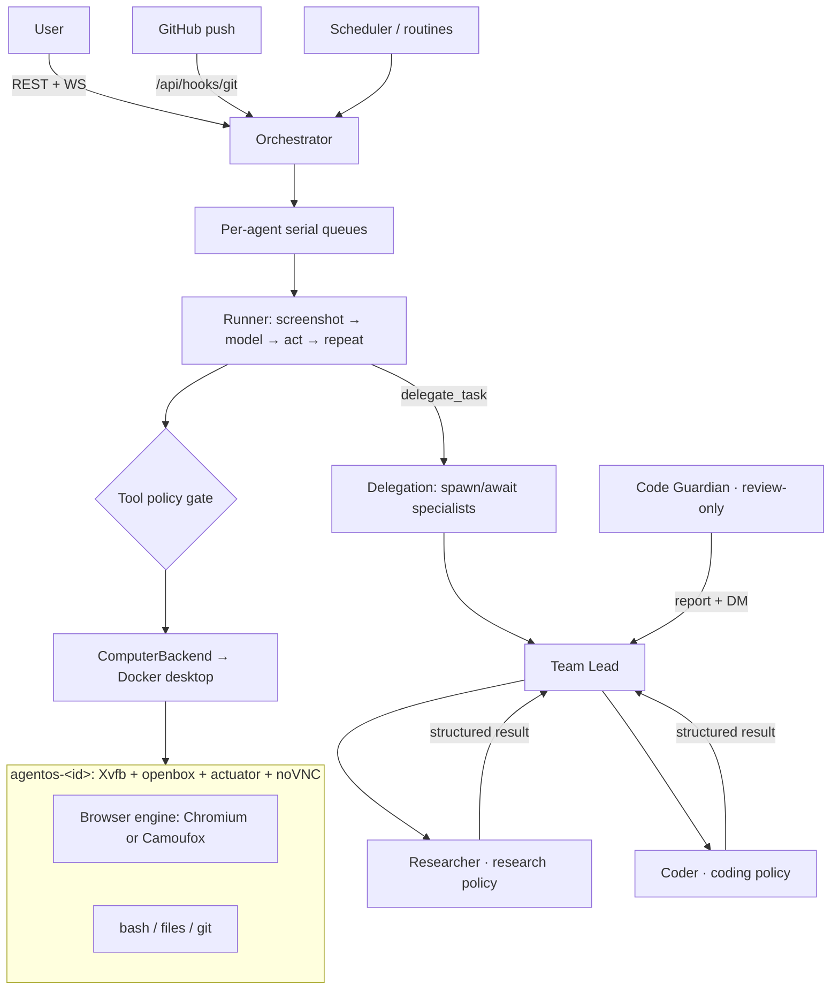

# GrokBot

Self-hosted AI agent teammates, modeled on xAI's Grok Bot — but **every agent gets its own
isolated operating system**, and it works with **any major AI provider**, running entirely on
your own machine (built for an Apple Silicon Mac mini).

- **Agents with real computers** — each agent owns a persistent Linux desktop (Docker container)
  with a browser, terminal, and files. It operates it like a human: moving the mouse, clicking,
  typing, and reading the screen.
- **iMessage-style chat** — agents are teammates in a sidebar. Give them a name, a job, and
  standing instructions; message them tasks.
- **Watch them work** — the "Agent computer" panel shows the live desktop (noVNC) with a running
  feed of clicks, keystrokes, and commands. Chat stays quiet: agents report only when necessary
  (a result, a blocker, or an approval), same as Grok Bot.
- **Agents talk to each other** — direct messages and group chats with @mentions; delegation and
  handoffs happen on their own computers, with hard turn budgets so they can't loop forever.
- **Hierarchical delegation** — a Team Lead can `delegate_task` to specialist sub-agents (spawned on
  demand or reused), running **in parallel** with isolated context; only a **structured summary**
  comes back, so the leader's context never explodes. The chat shows a live delegation card and a
  **Leader → Researcher → Coder** tree. See [Roles & delegation](#roles--delegation).
- **Roles & tool policies** — every agent has a first-class **tool policy** (Full / Research /
  Coding / Browser-only / Review-only / Custom) enforced at three layers, so a Researcher can't run
  dangerous shell commands and a reviewer doesn't get browser stealth.
- **Choice of browser engine** — Chromium (default) **or Camoufox**, a Firefox-based, engine-level
  anti-detect browser for hard sites. Per-agent toggle; the live desktop is identical either way.
  See [Browser engines](#browser-engines).
- **Code Guardian** (optional) — a permanent repo-health reviewer that runs on a schedule or on a
  **push-to-main webhook**, categorizes findings (bugs / performance / security / improvements), and
  DMs the Team Lead. It only suggests — never auto-merges. See [Code Guardian](#code-guardian).
- **Approvals** — consequential actions (deleting, sending, purchasing, `rm -rf`, force-pushes…)
  stop and ask you first, showing the exact pending command. Passwords/2FA use **Take over**:
  you drive the agent's screen directly while the agent pauses.
- **Memory** — agents keep durable preferences, facts, and task summaries per agent.
- **Stealth browsing** (per-agent, on by default) — the agent's browser is hardened against
  fingerprinting: realistic user-agent/timezone/locale, a bundled extension that spoofs the WebGL
  vendor/renderer (masking the software renderer), adds canvas/audio noise, and hides automation
  signals. Because agents drive a *real* desktop via OS-level input (not WebDriver/CDP),
  `navigator.webdriver` is already absent and there's no headless UA — this closes the remaining
  VM/fingerprint tells. Toggle it per agent; it applies live (no restart).
- **Grok Bot–style UI** — light iMessage look by default with a one-click dark theme, color-coded
  agents, duplicate / hide-from-sidebar, and a friendly onboarding state.
- **Attachments, pin, search, reactions, plugins, teach** — attach files to a chat (copied into the
  agent's `~/workspace/inbox`), pin teammates, search messages, react with emoji, add MCP/webhook
  plugins, and teach a skill by demonstrating it on the agent's computer. Desktop notices fire when
  a teammate finishes or needs you.
- **Native macOS desktop app** (Electron) — run the server locally or connect to your Mac mini as a
  "commander"; see [Desktop app](#desktop-app-macos).
- **Multi-model** — pick a provider per agent:

| Provider | Computer-use path | Default model |
|---|---|---|
| Anthropic (Claude) | Messages API `computer` tool | `claude-sonnet-4-5` |
| OpenAI | Responses API `computer_use_preview` | `computer-use-preview` |
| Google (Gemini) | Interactions API `computer_use` (desktop env) | `gemini-3.6-flash` |
| Generic / xAI / DeepSeek | Any OpenAI-compatible endpoint via a JSON action protocol (vision when the API accepts images; DeepSeek is text-only and uses bash to inspect the computer) | `grok-4` |

## Quickstart (Mac mini / Apple Silicon)

1. Install [Docker Desktop](https://www.docker.com/products/docker-desktop/) (or [OrbStack](https://orbstack.dev)) and [Node.js ≥ 20](https://nodejs.org).
2. Clone this repo, then:

```bash
bash scripts/setup.sh     # checks Docker, installs deps, builds the agent OS image, creates .env
# add at least one API key to .env (ANTHROPIC_API_KEY / OPENAI_API_KEY / GOOGLE_API_KEY / XAI_API_KEY)
npm run dev
```

3. Open the URL setup prints, hit **+ → New agent**, give it a name and a job, and message it.

**Team, skills, routines** (Grok Bot-style):

- Mark one agent **Team lead** so unmentioned group messages go to them; they delegate with `@Name` or `send_message_to_agent`. `@everyone` wakes the whole group.
- Save a **skill** in Profile (or ask the agent to `save_skill`). Type `/Skill name` in chat to run it. Enable per agent.
- Add a **routine** with a clock phrase (`every morning`, `every evening`, `weekdays at 8am`, `every 30 minutes until 4 AM`); **Test run** does real work. Type **Stop now** or use the Stop button to cancel in-progress work (including the current shell command) — a new message takes priority.
- Attach files with **+**, pin a chat, search messages from the sidebar, and add **Plugins** (MCP or webhook). **Teach a task** records a demo on the agent's screen and saves a skill.

`scripts/setup.sh` asks **how you'll use GrokBot** (see below). Health check anytime: `node scripts/doctor.mjs`

## Running it: single device vs. server + commander

Setup asks which fits you (re-run it anytime to switch):

1. **This device only** — the server and UI run on one machine; everything binds to `localhost`.
   Open `http://localhost:5173`.
2. **Server + commander (Tailscale)** — the Mac mini is the always-on **server** (runs the agents
   and their computers); you drive it from another device like a **MacBook** ("commander").
   Setup detects the Mac mini's **Tailscale IP** and binds the web UI and the live-desktop (noVNC)
   ports to it, so GrokBot is reachable only on your private tailnet. On the MacBook (joined to the
   same tailnet) open `http://<mac-mini-tailscale-ip>:5173`.

Only the web UI and the per-agent noVNC ports are ever exposed — the API and the in-container
actuator always stay on loopback and are reached through the Vite proxy on the server. If Tailscale
isn't detected, server mode falls back to binding all interfaces (`0.0.0.0`) with a warning; prefer
Tailscale (or a firewall) so the machine isn't open to your whole LAN/the internet.

Relevant `.env` keys (written by setup): `ACCESS_MODE`, `WEB_HOST`, `WEB_PORT`, `COMPUTER_BIND_HOST`.

## Desktop app (macOS)

Prefer a real app over a browser tab? Build the native macOS desktop app (Electron):

```bash
npm run app:dist        # builds the UI + Electron app → apps/desktop/release/GrokBot-*.dmg
```

Open the `.dmg` and drag **GrokBot** to Applications. On first launch it asks how to run:

- **Run on this device** — GrokBot launches its server locally (needs Docker + Node) and shows the UI.
  Point it at your GrokBot install folder (the one containing `apps/server`); the server runs from
  there with your system Node, reusing your dependencies and the built agent image.
- **Connect to a server (commander)** — the app is just the window; give it your server's URL,
  e.g. `http://<mac-mini-tailscale-ip>:8484`. This is the MacBook-drives-the-Mac-mini setup.

Change the choice anytime from **GrokBot → Settings…** (⌘,). To just develop/run it unpackaged:
`npm run app:dev`.

### Signing / "app is damaged" note
The default build is **unsigned** (no Apple Developer account needed). macOS Gatekeeper will warn on
first open — right-click the app → **Open**, or clear the quarantine flag:
`xattr -dr com.apple.quarantine /Applications/GrokBot.app`. To ship a signed + notarized build, add
your Developer ID identity and notarization credentials to `apps/desktop/electron-builder.yml`.

### Try it without an API key

Create an agent and set its **model** to `mock-scripted` — a deterministic test model that
understands simple directives (`run: <cmd>`, `open the browser to <url>`,
`tell @Agent: <msg>`, `ask approval to <thing>`, `remember: <note>`, and for delegation
`delegate to <Name>: <goal>`, `spawn <Name> as <Role>: <goal>`,
`delegate parallel: A=<goal>; B=<goal>`). It exercises the whole pipeline (real containers, real
clicks, real delegation) with no LLM calls.

## How it works

```
Browser UI (React, iMessage-style)  — chat, delegation cards, task tree, role badges
   │  REST + WebSocket
Node server (Fastify + SQLite)
   ├── Orchestrator: routes messages → per-agent serial task queues (parallel across agents)
   ├── Runner: screenshot → model action → execute → repeat  (per-provider adapters)
   │      └── tool policy enforced (schema + exec guard + prompt)
   ├── Delegation: delegate_task → spawn/await specialists → structured result (persisted tree)
   ├── Safety: rule engine + provider safety flags → approval cards; takeover pause
   ├── Scheduler + git webhook (/api/hooks/git) → routines / Code Guardian reviews
   └── ComputerBackend  ── DockerComputerBackend (dockerode) ──┐  (interface; host backend later)
          │ one container per agent                             │
   ┌──────┴─────────────────────────────────────┐              │
   │ agentos-<id>  (grokbot/agent-desktop)       │  Debian + Xvfb + openbox + tint2
   │  actuator API :8090 (xdotool/scrot/xclip)   │  browser engine: Chromium | Camoufox
   │   └ human-like mouse/typing/scroll          │  xterm, pcmanfm, mousepad, git
   │  noVNC :6080  (live view/takeover)          │  volume: /home/agent persists
   └─────────────────────────────────────────────┘

Delegation hierarchy (persisted, shown as a tree):
   Team Lead ──delegate_task──▶ Researcher (research policy)   ─┐ parallel, isolated context
             └────────────────▶ Coder      (coding policy)     ─┘ → only a structured summary returns
```



- Ports bind to **127.0.0.1 only** (host and containers) — nothing is exposed to your network.
- Agents run as a **non-root user** inside their container with memory/CPU limits
  (`COMPUTER_MEMORY`, default 2g / 2 CPUs) and `no-new-privileges`.
- Idle computers auto-stop after `COMPUTER_IDLE_STOP_MINUTES` (default 30); files, logins, and
  browser sessions survive in the agent's volume. `MAX_RUNNING_COMPUTERS` (default 4) caps
  concurrency — each agent OS uses roughly 1–2 GB RAM.

### What this is (and is not)

GrokBot is **our own code**. It is not Hermes, LangChain, DeepAgents, or xAI's hosted Grok Bot.
The loop is: screenshot → call a model API → run the action on a Docker desktop → repeat.
The "agent" is this repo plus whatever **HTTP model API** you point it at.

A ChatGPT / SuperGrok **consumer subscription is not an API key**. Hermes logs into those
products with a browser OAuth device-code flow and spends subscription quota. This app talks
to the public APIs (`api.openai.com`, `api.x.ai`) with `OPENAI_API_KEY` / `XAI_API_KEY`.
Those are separate products. SuperGrok $30 chat ≠ an xAI developer key.

To run without your own developer key today: use `mock-scripted`, or put a real API key
(or any OpenAI-compatible key, e.g. OpenRouter) in `.env`. Subscription OAuth like Hermes
is not implemented — adding it means a device-code login, token refresh, and a new provider
id; xAI has also been seen to 403 some SuperGrok tiers on that OAuth surface.

## Roles & delegation

Every agent has a **tool policy** that scopes what it may do — a preset (or a custom allow-list):

| Policy | Can use | Good for |
|---|---|---|
| **Full** | everything (incl. `delegate_task`) | Team Leads / general agents |
| **Research** | computer, bash, plugins, message teammates | web research + read |
| **Coding** | bash, computer, plugins, `save_skill` | writing code/files |
| **Browser-only** | computer, plugins | pure GUI browsing |
| **Review-only** | bash, plugins | inspect + report (Code Guardian) |
| **Custom** | your explicit allow-list | anything bespoke |

Reporting/safety tools (`send_message`, `request_approval`, `task_complete`, `update_memory`) are
always available. The policy is enforced in three layers: the tool schema sent to the model omits
disallowed tools, the server **refuses** a disallowed tool even if a model ignores the schema, and
the system prompt states the policy. Set it per agent in **Agent → Tool policy**.

**Delegation.** A Team Lead (or any Full-policy agent) can call `delegate_task` with one or more
sub-tasks:

- Each sub-task goes to an **existing teammate** (`agentName`) or **spawns a new permanent
  specialist** (`spawn`, with its own restricted tool policy).
- Sub-agents run in **their own private thread** with **isolated context** — only the goal + context
  you pass, never the parent's whole transcript.
- Sub-tasks run **in parallel** (up to `DELEGATE_CONCURRENCY`), each with a timeout and step cap.
- Only a **distilled structured result** returns to the parent, so its context stays small — this is
  the key to answering a complex request without the leader's context exploding.
- `MAX_SPAWN_DEPTH` (default 1 = flat) bounds nesting; leaf specialists can't sub-delegate. Turn
  budgets still apply so nothing can loop forever.

Spawned specialists are **permanent teammates** (full conversation history is kept, badged
*Specialist* in the sidebar). To avoid stalled containers, a specialist's *computer* is stopped
after `SPECIALIST_IDLE_STOP_MINUTES` (default 10) — its files + history persist and the computer
reboots on the next task. In chat you'll see a **delegation card** with each specialist's live
status; a **View tree** button shows the *Leader → Researcher → Coder* hierarchy.

## Browser engines

Each agent's computer can run one of two browsers (per-agent toggle in **Agent → Browser engine**;
global default via `BROWSER_ENGINE`):

- **Chromium** (default) — the bundled Chromium plus the JS **stealth extension** (spoofs WebGL
  vendor/renderer, adds canvas/audio noise, hides automation signals).
- **Camoufox** — a Firefox-based, **engine-level** anti-detect browser for hard sites. Its
  fingerprint config is injected via `CAMOU_CONFIG` at the C++ level.

Either way the browser is driven by **OS-level input** (xdotool), not WebDriver/CDP, so
`navigator.webdriver` stays false and there's no headless UA. Switching engines applies live (no
container recreate). Camoufox is **bundled in the agent image by default** (`npm run image:build`);
build with `bash images/agent-desktop/build.sh --no-camoufox` to skip it for offline/CI builds (the
wrapper then falls back to Chromium). For the hardest sites, pair Camoufox with **residential
proxies** and a **consistent profile** — the browser alone isn't a silver bullet.

## Code Guardian

An optional, permanent **repo-health reviewer** (inspired by Cursor Automations). Enable it by
setting `CODE_GUARDIAN=1` (or just setting `GIT_WEBHOOK_SECRET`), or seed it manually:

```bash
npx tsx apps/server/scripts/seed-code-guardian.ts
```

This creates a **Review-only** agent named *Code Guardian*, a `/Codebase health review` skill, and a
**disabled** *Hourly main-branch review* routine (enable it in the Routines panel). When it runs it
clones/pulls the target repo (`CODE_GUARDIAN_REPO`, or one named in the request), inspects it, runs
tests/linters if present, and writes a categorized report — **bugs / performance / security /
improvements** — to `~/workspace/reports/`, then DMs the Team Lead. It **never** auto-merges; opening
a PR requires your approval.

**Push-to-main trigger.** Set `GIT_WEBHOOK_SECRET` and point a GitHub push webhook at
`POST /api/hooks/git`, sending the secret as the `x-webhook-token` header (or `?token=`). A push to
`CODE_GUARDIAN_BRANCH` (default `main`) kicks off a review; other branches are ignored. The endpoint
is **disabled** unless the secret is set, and the token is checked in constant time.

## Configuration

Copy `.env.example` → `.env`. Notable settings:

| Variable | Default | Purpose |
|---|---|---|
| `ANTHROPIC_API_KEY` … `XAI_API_KEY` | — | provider credentials (set the ones you use) |
| `XAI_BASE_URL` | `https://api.x.ai/v1` | any OpenAI-compatible endpoint for the generic provider |
| `MAX_RUNNING_COMPUTERS` | 4 | concurrent agent OS cap |
| `COMPUTER_IDLE_STOP_MINUTES` | 30 | auto-stop idle computers (0 = never) |
| `COMPUTER_RESOLUTION` | 1280x800 | desktop size per agent |
| `MAX_TASK_STEPS` | 60 | per-task action cap |
| `MAX_AGENT_TURNS` | 8 | agent↔agent turns per user request (loop prevention) |
| `MAX_SPAWN_DEPTH` | 1 | delegation depth (1 = flat; 2 = nested orchestrators) |
| `DELEGATE_CONCURRENCY` | 2 | delegated sub-tasks run in parallel (keep ≤ `MAX_RUNNING_COMPUTERS`) |
| `DELEGATE_TIMEOUT_SEC` | 300 | default per-sub-task timeout |
| `SPECIALIST_IDLE_STOP_MINUTES` | 10 | idle-stop a spawned specialist's computer (history persists) |
| `BROWSER_ENGINE` | `chromium` | default engine for new agents (`chromium` or `camoufox`) |
| `BROWSER_USER_AGENT` | current desktop Chrome UA | UA presented by stealth browsing |
| `BROWSER_TIMEZONE` | `America/New_York` | timezone the stealth browser reports |
| `BROWSER_LOCALE` | `en-US` | locale the stealth browser reports |
| `CODE_GUARDIAN` | `0` | seed the Code Guardian repo-health agent on boot |
| `CODE_GUARDIAN_REPO` | — | default repo Code Guardian reviews |
| `CODE_GUARDIAN_BRANCH` | `main` | branch a push webhook must target |
| `GIT_WEBHOOK_SECRET` | — | token for `POST /api/hooks/git` (empty = webhook disabled) |

## Development

```bash
npm run dev          # server (:8484) + web (:5173), hot reload
npm test             # unit tests (adapters, safety rules, orchestrator)
npm run typecheck    # all workspaces
npm run image:build  # rebuild the agent OS image
RUN_DOCKER_TESTS=1 npm run test:integration -w apps/server   # real-Docker container tests
```

Repo layout: `apps/server` (Fastify API + runtime — orchestrator, runner, delegation, tool policy,
Code Guardian, computer backend), `apps/web` (React UI — chat, delegation card/tree, role badges),
`apps/desktop` (Electron macOS app), `packages/shared` (types + action schema),
`images/agent-desktop` (the agent OS: actuator, browser wrapper, Camoufox), `scripts/` (setup,
doctor). Seeds: `apps/server/scripts/seed-code-guardian.ts`, `seed-delegation-demo.ts`.

## Differences from the real Grok Bot

| | Grok Bot | This project |
|---|---|---|
| Computers | one shared cloud VM per user (per-bot screens) | **one isolated OS per agent**, local |
| Models | Grok only | Anthropic / OpenAI / Gemini / any OpenAI-compatible |
| Hosting | xAI cloud | your machine |
| Reporting | finish the job; come back for a result, blocker, or approval | same policy: sandbox actions stay on Agent Computer; chat is `send_message` / `task_complete` / approvals only |
| Skills | `/` menu, save after a working process | yes — `/Name` in chat, Profile toggle, `save_skill` tool |
| Routines | schedule / event trigger, test run | clock phrases (`every morning`, `until 4 AM`, weekdays) + test run. No Slack/GitHub event triggers yet |
| Team lead / coordinator | a Bot owns unmentioned group work and delegates | yes — Team lead checkbox, `@Name` / `@everyone` |
| Mid-task redirect / Stop now | new user message takes priority; “Stop now” cancels | yes |
| Create a focused Bot | existing Bots can spawn a specialist | yes — `create_agent` |
| Hierarchical delegation | leader hands work to specialists | yes — `delegate_task`: parallel spawn/await, isolated context, structured result, persisted **tree** |
| Roles / tool scoping | per-bot permissions | yes — first-class **tool policies** (Full/Research/Coding/Browser-only/Review-only/Custom), enforced server-side |
| Anti-detect browser | hardened Chrome | Chromium + JS stealth **or** engine-level **Camoufox** (per-agent) |
| Scheduled repo review | Automations | optional **Code Guardian** (schedule + push-to-main webhook; suggests, never auto-merges) |
| Teach-a-task (record demo) | optional, up to 10 minutes | yes — Profile / rail **Teach a task** takes over the agent computer, captures key frames, and saves a skill |
| Connectors / Plugins / MCP | yes | yes — sidebar **Plugins** (MCP stdio or webhook); agents call `call_plugin` |
| Chat attachments, threads, reactions | yes | attachments + emoji reactions; hierarchical agent threads (not Slack-style reply trees) |
| Notifications (done / needs input) | desktop + iOS | desktop + in-app banner (no iOS app) |
| Search / pin / @everyone | yes | sidebar agent + message search, pin chats, `@everyone` |
| Hierarchical agent↔agent chat | view-only panel in the current workspace, not a sidebar chat | yes — `Messaged` / `From` chips open the private thread |
| Mid-task Stop now | cancels the current computer-use turn | yes — also aborts the in-flight shell/exec (rebuild the agent image with `npm run image:build` so `/abort` exists in running containers) |
| `@everyone` / multi-bot dispatch | quieter sequential handoff | teammates run one after another instead of all booting at once |
| Mobile apps | iOS | not yet |
| Local-computer execution | optional, approval-gated | no (agents stay in their container) |

## Security notes

Agents can browse the web and run commands inside their containers. Treat each agent's computer
as semi-trusted: don't paste secrets into chats, use Take over for passwords/2FA (they go straight
to the agent's screen, never through a model), and keep the approval rules on.

In **single-device** mode everything binds to localhost. In **server + commander** mode the web UI
and noVNC ports become reachable from other devices — do this only over a private network like
**Tailscale** (which authenticates devices and encrypts traffic). GrokBot itself has no built-in
login, so never bind it to a public interface or port-forward it to the internet without putting
authentication (e.g. a reverse proxy, or Tailscale ACLs) in front of it.
