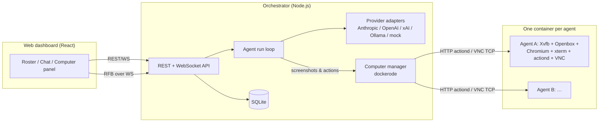

# Botbox

**A self-hosted team of always-on AI agents — each with its own computer.**

Botbox is an agent-management platform inspired by Grok Bot. You create named agents,
give each one a role, and message them like coworkers. Each agent gets its **own
isolated Linux desktop** (a Docker container with a real display, browser, terminal,
and filesystem) that it operates the way a human would: moving the mouse, clicking,
and typing. Agents can message each other to hand off work, and you can watch any
agent's screen live — or take over the controls yourself.

Unlike Grok Bot, Botbox is **model-agnostic**: every agent can run on a different
model — Anthropic (Claude), OpenAI, xAI (Grok), or any OpenAI-compatible endpoint
(Ollama, OpenRouter, vLLM, …).

## Feature overview

| Feature | Botbox | Grok Bot |
| --- | --- | --- |
| Named agents with roles & standing rules | ✅ | ✅ |
| Agent computer (browser, terminal, files) | ✅ one **isolated OS per agent** | ⚠️ one shared computer per account |
| Computer use (mouse, keyboard, screenshots) | ✅ | ✅ |
| Live screen view + human takeover | ✅ | ✅ |
| Agent-to-agent messaging / handoffs | ✅ | ✅ |
| Per-agent memory | ✅ | ✅ |
| Ask-user / approval pauses | ✅ | ✅ |
| Model choice per agent | ✅ any provider | ❌ auto-routed only |
| Third-party connectors / plugin marketplace | ❌ out of scope | ✅ |
| Teach-by-screen-recording | ❌ out of scope | ✅ |

Because every agent has its own OS, an agent's logins, files, and cookies are
**not** visible to your other agents — each container *is* a security boundary,
which is exactly what Grok Bot's shared computer cannot offer.

## Architecture



- **`computer/`** — the agent computer image: Debian + Xvfb virtual display, Openbox,
  Chromium, xterm, plus `actiond`, a small HTTP daemon exposing `screenshot`,
  mouse/keyboard actions (via `xdotool`), and shell execution. A VNC server
  (`x11vnc`) exposes the display; the orchestrator proxies it to the dashboard.
- **`server/`** — the orchestrator. Manages agents and their containers, runs the
  perceive→reason→act loop against the configured model provider, persists
  conversations in SQLite, routes agent-to-agent messages, and streams events to
  the dashboard over WebSocket.
- **`web/`** — the dashboard. Agent roster with live status, chat threads,
  and an embedded noVNC viewer with watch / take-control modes.

## Quickstart

Requirements: Node.js ≥ 20, Docker (daemon running), ~2 GB disk for the computer image.

```bash
npm install                  # installs server + web workspaces
npm run build:computer       # builds the botbox-computer Docker image
npm run dev                  # orchestrator on :4400, dashboard on :5173
```

Open http://localhost:5173, add a provider API key in **Settings** (or export
`ANTHROPIC_API_KEY` / `OPENAI_API_KEY` / `XAI_API_KEY` before starting the server),
then create your first agent and message it.

No API key? Create an agent with the **mock** provider — it runs a scripted
computer-use demo so you can verify the whole pipeline.

### Production build

```bash
npm run build                # builds web/dist and server/dist
npm start                    # serves dashboard + API on :4400
```

## Model providers

| Provider | Env var | Notes |
| --- | --- | --- |
| `anthropic` | `ANTHROPIC_API_KEY` | Native Messages API with vision |
| `openai` | `OPENAI_API_KEY` | Chat Completions with vision |
| `xai` | `XAI_API_KEY` | Grok models via OpenAI-compatible API |
| `openrouter` | `OPENROUTER_API_KEY` | Any hosted model via OpenAI-compatible API |
| `ollama` | — | Local models; set base URL in Settings (default `http://localhost:11434/v1`) |
| `custom` | — | Any OpenAI-compatible endpoint |
| `mock` | — | Offline scripted provider for testing |

Keys can be entered in the dashboard Settings (stored in SQLite) or provided as
environment variables; the dashboard takes precedence.

## Security notes

- Each agent's container is isolated: separate filesystem, browser profile, and
  process space. Deleting an agent removes its container and its volume.
- Agents run as a non-root user inside their containers.
- The orchestrator binds to localhost by default. If you expose it, put it behind
  authentication — the dashboard has no built-in auth yet.
- Agents are instructed to pause and ask you before irreversible actions (sending,
  publishing, purchasing, deleting), but this is prompt-level guidance, not a
  hard guarantee. Watch the screen for sensitive work and use takeover for logins
  so credentials never enter the conversation.

## Repository layout

```
computer/   Agent computer Docker image (display, browser, actiond)
server/     Orchestrator: API, agent loop, provider adapters, container manager
web/        React dashboard
docs/       API contract and design notes
```
